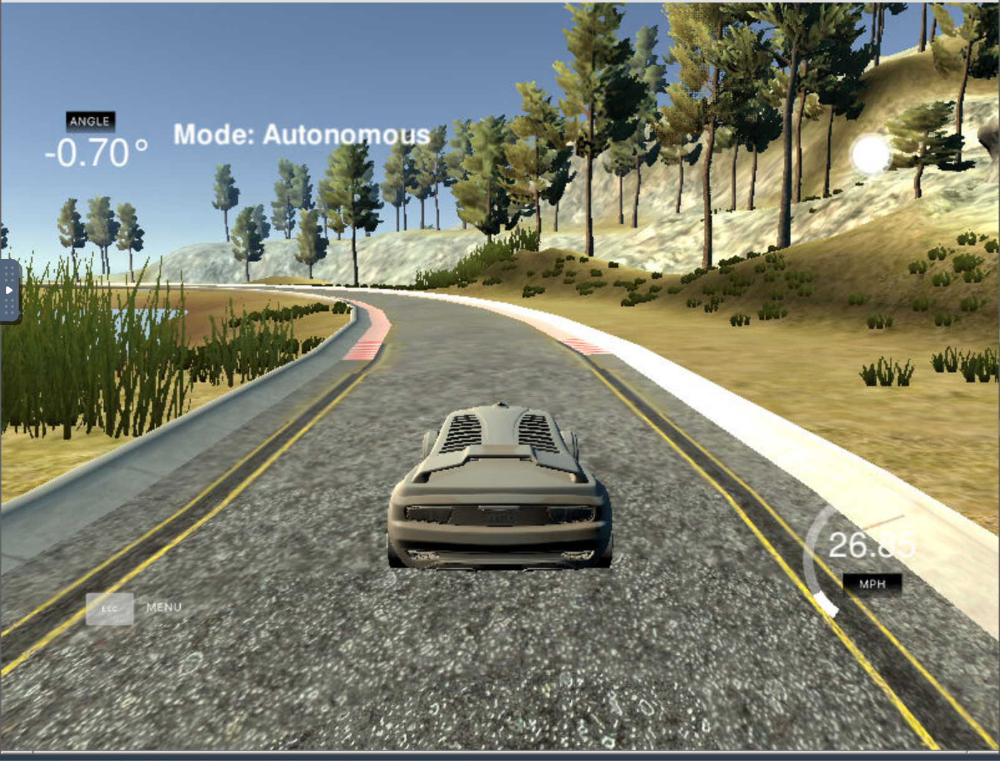

# CarND-Controls-PID
In this project, a C++ implentation of a PID is used to steer a simulator car around a track. At each time step, the PID takes in a cross track error measurement and outputs a steering angle value. This project was completed as part of the Self-Driving Car Engineer Nanodegree Program.


## Demo
A demo of the pid controller running in a simulator can be found in the "final_pid.mov" file. 



## Dependencies

* cmake >= 3.5
 * All OSes: [click here for installation instructions](https://cmake.org/install/)
* make >= 4.1(mac, linux), 3.81(Windows)
  * Linux: make is installed by default on most Linux distros
  * Mac: [install Xcode command line tools to get make](https://developer.apple.com/xcode/features/)
  * Windows: [Click here for installation instructions](http://gnuwin32.sourceforge.net/packages/make.htm)
* gcc/g++ >= 5.4
  * Linux: gcc / g++ is installed by default on most Linux distros
  * Mac: same deal as make - [install Xcode command line tools]((https://developer.apple.com/xcode/features/)
  * Windows: recommend using [MinGW](http://www.mingw.org/)
* [uWebSockets](https://github.com/uWebSockets/uWebSockets)
  * Run either `./install-mac.sh` or `./install-ubuntu.sh`.
  * If you install from source, checkout to commit `e94b6e1`, i.e.
    ```
    git clone https://github.com/uWebSockets/uWebSockets 
    cd uWebSockets
    git checkout e94b6e1
    ```
    Some function signatures have changed in v0.14.x. See [this PR](https://github.com/udacity/CarND-MPC-Project/pull/3) for more details.
* Simulator. You can download these from the [project intro page](https://github.com/udacity/self-driving-car-sim/releases) in the classroom.

Fellow students have put together a guide to Windows set-up for the project [here](https://s3-us-west-1.amazonaws.com/udacity-selfdrivingcar/files/Kidnapped_Vehicle_Windows_Setup.pdf) if the environment you have set up for the Sensor Fusion projects does not work for this project. There's also an experimental patch for windows in this [PR](https://github.com/udacity/CarND-PID-Control-Project/pull/3).

## Basic Build Instructions

1. Clone this repo.
2. Make a build directory: `mkdir build && cd build`
3. Compile: `cmake .. && make`
4. Run it: `./pid`. 

Tips for setting up your environment can be found [here](https://classroom.udacity.com/nanodegrees/nd013/parts/40f38239-66b6-46ec-ae68-03afd8a601c8/modules/0949fca6-b379-42af-a919-ee50aa304e6a/lessons/f758c44c-5e40-4e01-93b5-1a82aa4e044f/concepts/23d376c7-0195-4276-bdf0-e02f1f3c665d)

---
## Reflection
#### Final Parameter Values
The final parameter values were
| Parameter | Value         | 
| :----------:|:-------------:| 
| Kp        | 0.12 | 
| Ki        | 0       | 
| Kd        | 0.025      |   
#### Role of Each PID Component

Proportional (Kp): This component serves the primary role of correcting the steering value in proportion to the immediate error value.

Integral (Ki): This component the serves the primary role of correcting for systematic bias such as steering drift. 

Derivative (Kp): This component the serves the primary role of damping oscillations and preventing overshoot.

#### Empirical Tuning Process:
* The Kp value was increased in an attempt to strengthen the corrective power of the control enough to make the sharpest turns on the track. 
* Kd was increased to dampen the oscillations that arised from increasing Kp.
* The optimal Ki value was found to be zero because the simulator car does not seem to have any source of systematic bias.  

#### Parameter Constraints Derived from Observation:
* If Kd is too high relative to Kp then the controller becomes too slow and sharp turns cannot be made. 
* If Kp is too high relavtive to Kd then the car oscillates on the road. 
* If Kp is too high relative to the speed then the car is able to stay on the track, but the steering angles reach values that are too high to be safe and comfortable. 
* If the value of Kp is too low relative to the speed then sharp turns cannot be made because CTE correction is not fast enough.

#### Conclusion
The current paramter values are optimized for traversing the simulator track at a fixed speed (just under 30mph). The "final pid.mov" file in the project folder shows the PID's performance under these conditions. 

If the speed or the track were changed then the paramters would likely have to be re-tuned. However, the experimental parameter constraints outlined would remain relevant under the new conditions and could be used to effectively re-tune the parameters.

To make the control more robust, instead of using a fixed throttle, another PID could be added to control throttle. This would make the driving more versatile and human-like.